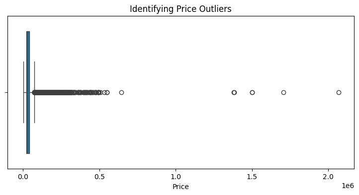
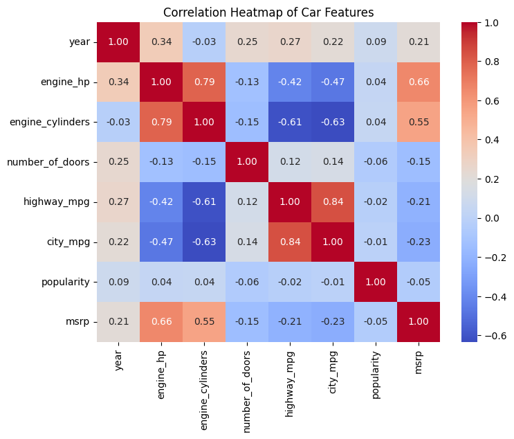
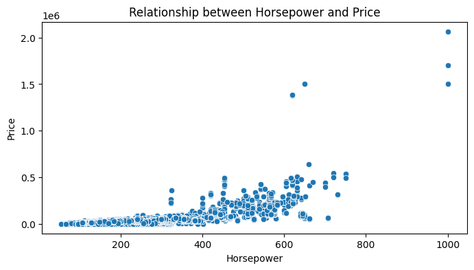
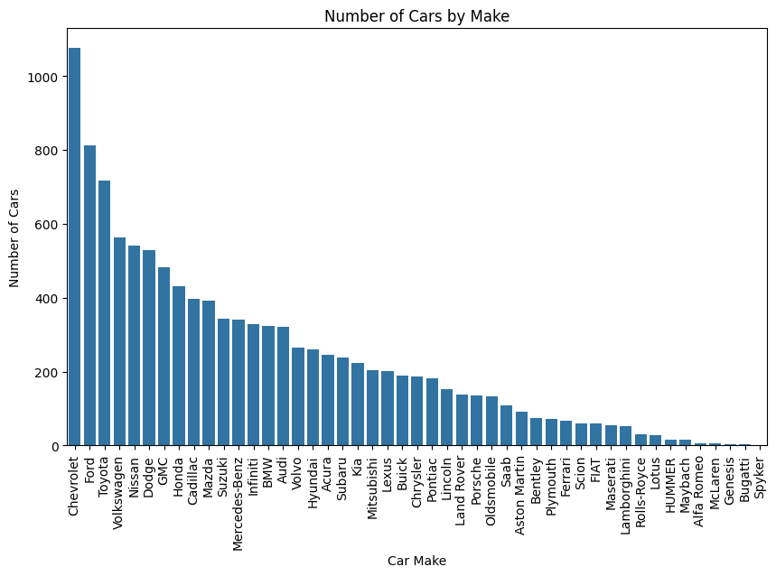

# Automotive Market Analysis: Exploratory Data Analysis (EDA)

### 📈 Project Objective
To identify the core variables that influence vehicle MSRP (pricing) using a dataset of 11,000+ records. This analysis provides data-driven insights for pricing strategy and market positioning.

### 💡 Key Insights (The "Numbers")
* **Price Driver:** Confirmed a **0.66 positive correlation** between Engine HP and MSRP.
* **Fuel Efficiency:** Identified a **-0.73 negative correlation** between Engine Cylinders and Highway MPG.
* **Data Quality:** Cleaned the dataset by removing **989 duplicates** and handling missing values, resulting in a final pool of **10,827 verified entries**.
* **Market Representative:** Top 2 brands identified as **Chevrolet (1,123)** and **Ford (881)**.

### 🛠️ Technical Workflow
1. **Data Wrangling:** Dropped irrelevant features (`market_category`, `engine_fuel_type`) to simplify the data model.
2. **Exploratory Visualization:** Utilized **Seaborn Boxplots** to identify luxury price outliers (Supercars) that skew the average.
3. **Statistical Modeling:** Created a **Correlation Matrix** to visualize multi-variable relationships.
4. **Aggregation:** Grouped data by Transmission and Brand to analyze mean price distributions.

### 🐍 Tech Stack
* **Language:** Python 3.x
* **Libraries:** Pandas, NumPy, Matplotlib, Seaborn
* **Tool:** Google Colab / GitHub

### 📊 Project Visualizations

### 1. Price Outliers (MSRP)

*Detected extreme luxury price outliers to ensure a representative analysis of the mass market.*

### 2. Feature Correlation Heatmap

*Identified a 0.66 correlation between Horsepower and MSRP, confirming performance as a primary price driver.*

### 3. Engine HP vs. Price Relationship

*Visualizing the positive linear relationship between engine performance and vehicle cost.*

### 4. Top 10 Manufacturers by Volume

*Distribution of the most frequent brands within the dataset, led by Chevrolet and Ford.*
